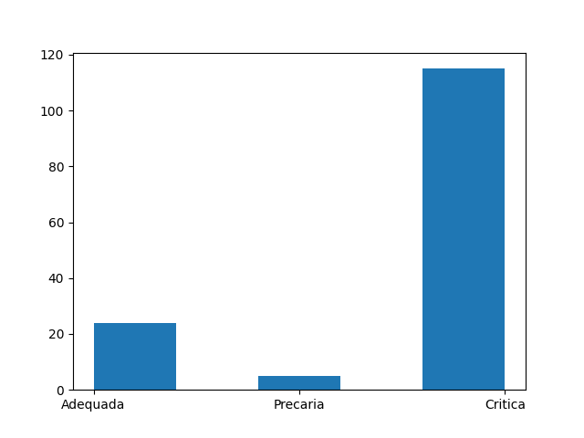

# **Projeto demonstração Prodist**

Este projeto é resultado dos estudos obtidos durante a disciplina de estudo dirigido de **Distribuição de Energia Elétrica**, nele realizamos cálculos a partir do item 2 do módulo 8 do Prodist.

No Arquivo Aula1.py foi projetado um programa simples para cálculo de THDu onde o mesmo solicita os valores das Harmônicas, o valor de U1 e realiza o cálculo.

Já no Arquivo Aula2.py começamos o projeto de um filtro interativo da tabela de medição do prodist a qual normalmente possui 144 medições por dia (uma a cada 10 minutos), para utilizar o programa você deverá criar um arquivo Excel (xlsx) com duas colunas a coluna **A**  deverá conter os dados de horário, ou seja das 00:00:00 hrs às 23:50:00 separadas a cada 10 minutos, exemplo:

Horário |medição |
--------|--------|
00:00:00| 220    |
00:10:00| 250    |
00:20:00| 260    |

Essa tabela do Excel deverá conter uma segunda coluna onde chamamos **medição**, assim como é possível observar no exemplo acima, os valores de medição podem variar para sua faixa de tensão escolhida, 110 ou 220 volts.
Criada esta tabela você deverá nomea-la, em nosso projeto utilizamos o nome **planilha**. 
O projeto foi idealizado em Python, utilizamos a biblioteca **Pandas, Numpy e Openpyxl** que são necessarias para a execução do código.
Este código quando rodado sobrescreve a planilha Excel que tem apenas duas colunas e cria uma terceira a coluna **TA** nela as condições de filtragem foram aplicadas conforme o item 2 do módulo 8 do Prodist e agora os valores são classificados como **Adequada, Precaria e Critica**.

***É preciso ter cuidado com o código da Aula2, pois sempre que ele for rodado ele ira sobrescrever a tabela, então se realizar alguma mudança ela será perdida, para utilizar outras partes do código sem a parte de gravação comente (utilize `#`) no seguinte trecho de código:**

```python
df.to_excel('C:/Caminho_da_planilha/planilha.xlsx',index=False)
```
No arquivo da Aula3.py utilizamos também a biblioteca **Pandas**, mas dessa vez como a intenção deste código é a plotagem de um gráfico onde seja possível observar as classificações foram necessários utilizarmos também a biblioteca **Matplotlib.pyplot**, como a tabela possui uma grande quantidade de dados (144 medições), não foi possível utilizarmos um gráfico de Pizza, e optamos por um gráfico de barras simples, mas objetivo.
O gráfico será apresentado desta forma:

<center></center>
